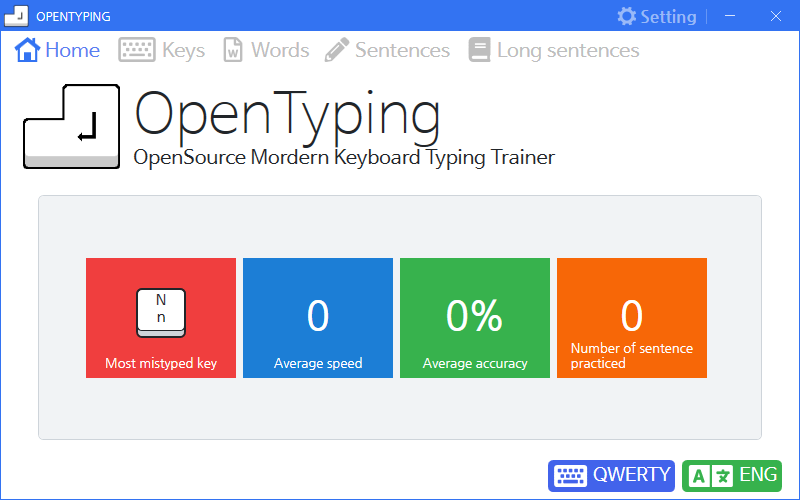
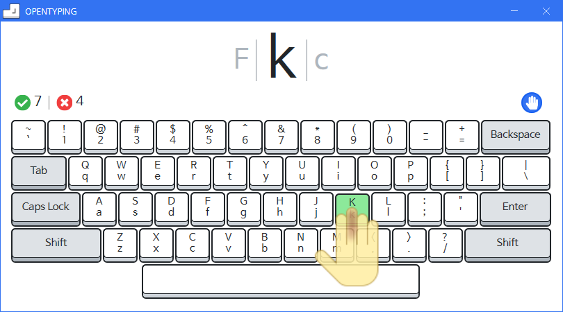
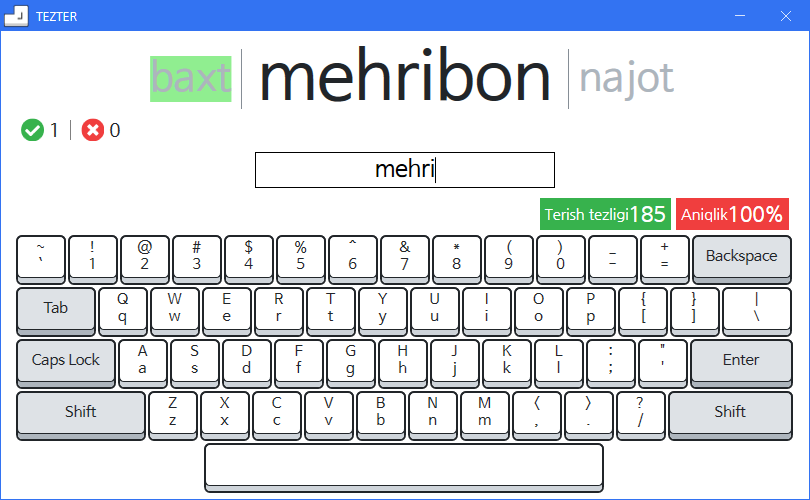
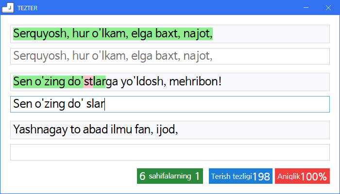

# 열린타자

열린타자는 현대적인 오픈 소스 타자 연습 프로그램입니다. 다양한 자판 종류 (사용자가 추가할 수 있음) 지원, 보기 좋은 디자인, 쓰기 쉬운 인터페이스의 제공이 목표입니다.

현재까지 구현된 연습의 종류는 자리 연습, 음절 연습 (한글 한정), 문장 연습, 긴 글 연습이 있습니다. 추후에 단어 연습 등을 추가할 예정입니다.

## 사진

## 기여

매우 환영합니다!
